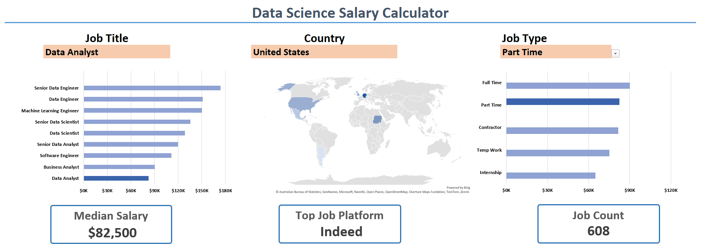

# **Data Science Industry's Salary Dashboard**

## **Project Overview**
The **Data Science Salary Dashboard** provides a comprehensive analytical overview of job market trends within the global data science and analytics domain.  
Developed in Microsoft Excel, this interactive dashboard enables users to examine salary structures, job roles, and employment dynamics across regions, industries, and work types.  

The project leverages structured data to uncover insights into compensation patterns, company demand, and technical skill distribution.

---

## **Key Features**
- **Interactive Salary Calculator:**  
  Customizable tool to estimate salary averages based on job title, country, and work type.
  
- **Data Exploration:**  
  Aggregated dataset including roles such as *Data Scientist, Machine Learning Engineer, and Data Analyst* across multiple countries.
  
- **Skill Frequency Analysis:**  
  Identification of most in-demand skills (e.g., Python, SQL, AWS, TensorFlow, Tableau).
  
- **Work Type Distribution:**  
  Breakdown of job listings by *full-time, part-time, hybrid,* and *remote* categories.
  
- **Geographical Insights:**  
  Regional analysis of salary averages and hiring concentration across the United States and international markets.

---

## **Dataset Structure**
| Sheet Name | Description |
|-------------|-------------|
| **Data** | Primary dataset containing job title, location, company, posting source, salary rates, and required skills. |
| **Salary Calculator** | Interactive dashboard to dynamically estimate average salaries based on filters. |
| **Country / Title / Type / Platform** | Reference tables supporting dropdowns, validation, and category mappings. |
| **Data_Validation** | Excel configurations for ensuring dataset consistency and user input integrity. |

---

## **Key Metrics and Columns**
- **Job Title:** Distinct classifications such as **Data Engineer**, **ML Engineer**, **Senior Data Scientist**  
- **Salary_Year_Avg / Salary_Hour_Avg:** Annual and hourly pay rates  
- **Job Country / Location:** Geographical identifiers for global analysis  
- **Company Name:** Employer identity and hiring organization  
- **Job Skills:** List of technical and analytical proficiencies  
- **Job Schedule Type:** Employment format (Full Time, Part Time, etc.)  

---

## **Technologies Used**
- **Microsoft Excel (Power Query, Data Validation, Pivot Charts, Formulas)**  
- **Python (optional pre-processing using pandas, if integrated)**  
- **Data Sources:** Curated from public job boards (Indeed, ZipRecruiter, AI-Jobs.net, etc.)  

---

## **Usage**
1. Download or clone this repository:
   ```bas
   https://github.com/Minhajulhoque/Project_1_Salary_Dashboard.git
3. Navigate to the **Salary Calculator** sheet to interact with dropdowns and visual dashboards.  
4. Use filters by *country*, *title*, or *employment type* to view targeted insights.  
5. Optionally, explore the **Data** sheet for raw job listings and analytical experimentation.

---

## **Analytical Insights**
- Median salary levels are concentrated around USD **$120,000–$150,000** for senior-level data professionals.    
- The United States exhibits the highest job concentration, followed by emerging markets such as India and Europe.  
- **Remote positions** are increasingly represented, reflecting evolving work flexibility trends.

---

## **License**
This project is released under the **MIT License**, permitting open usage, adaptation, and educational distribution.

---

## **Data source**
The Dataset and project are part of educational Excel course from Luke Barousse on [Youtube](https://www.youtube.com/watch?v=pCJ15nGFgVg&t=19840s). I really appriciate his work and the way he helps people on their proffecional way!

---

## **Author**
- Created by **Minhajul Hoque**  *Executive - Asset Management | Arshee Inc* in 2025.
- Excel for Data Analytics course uploaded in 2024 by Luke Barousse.

---
